# YDS Premium Fusion - MCP使用指南

## 1 检查是否自动获取到JDK17以上版本

没有的话需要自己按照自己的操作系统指定一下JDK17以上版本

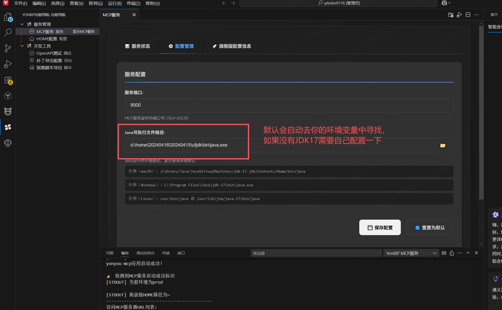

## 2 配置租户与选择BIP版本

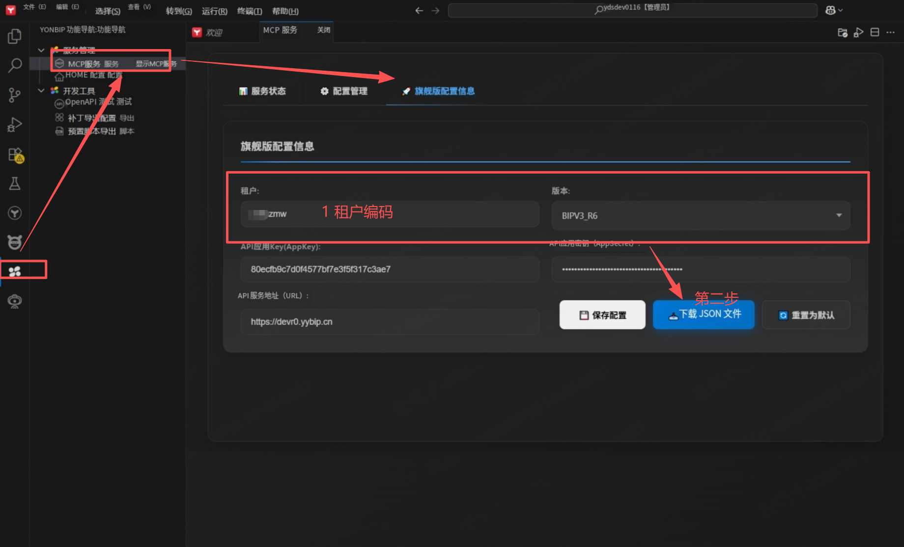


## 3 将下载的JSON文件导入到系统的API发布中

导入后需要全部发布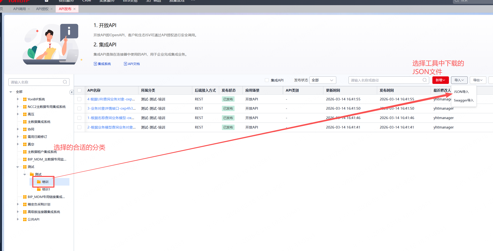

## 4 API调用处新增授权

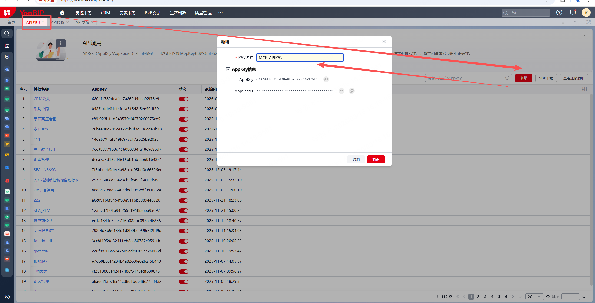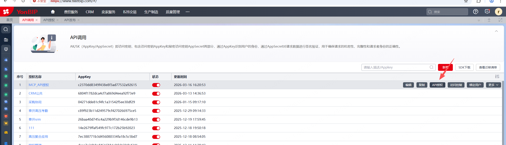

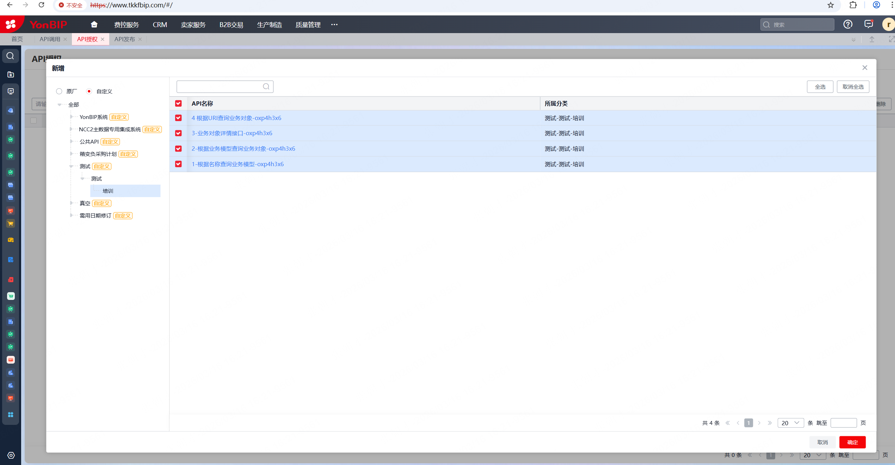

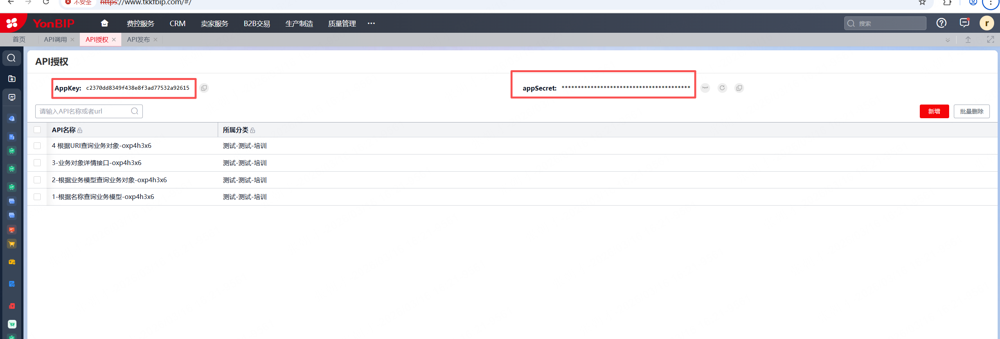


## 5 配置密钥信息到插件中

配置好后进行保存

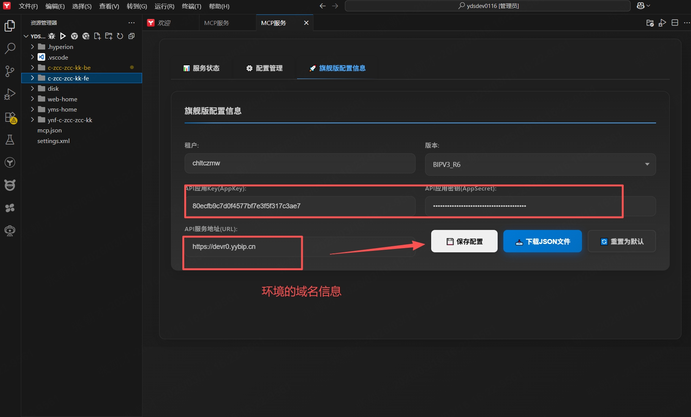


## 6 启动服务

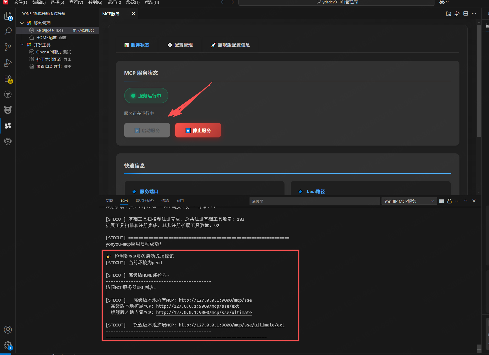


# 常见问题

证书错误：请求业务对象信息失败: PKIX path building failed: sun.security.provider.certpath.SunCertPathBuilderException: unable to find valid certification path to requested target


解决方案：

## 1 去浏览器中手动导出证书，文件名后缀改为.crt

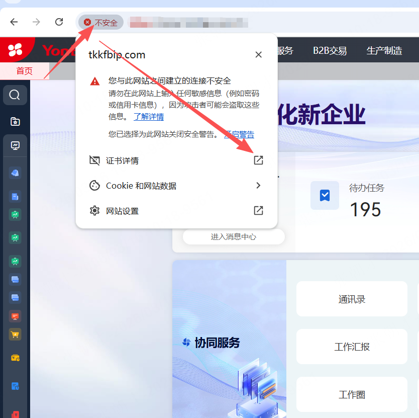

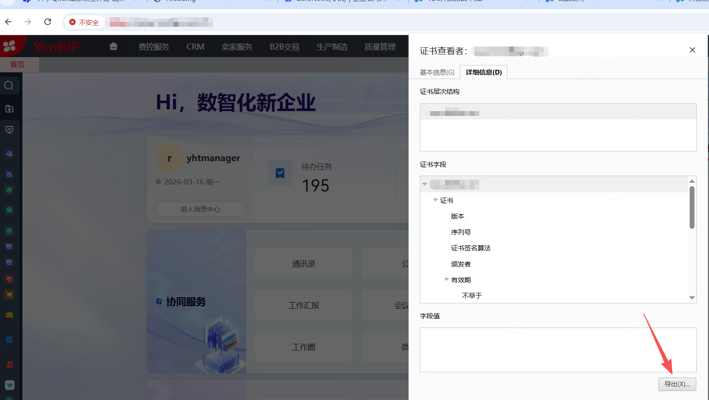

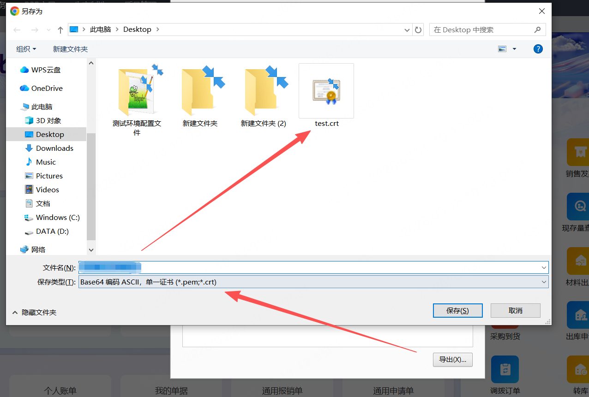


## 2 拿到证书后执行导入命令到JDK中

```
"D:\home\20240515\ufjdk\bin\keytool.exe" -import -alias tkkfbip-cert -file "C:\Users\Administrator\Desktop\test.crt" -keystore "D:\home\20240515\ufjdk\lib\security\cacerts" -storepass changeit
```

D:\home\20240515\ufjdk\bin\keytool.exe： 替换为自己的jdk路径\bin\keytool.exe

C:\Users\Administrator\Desktop\test.crt： 替换为自己的证书路径

D:\home\20240515\ufjdk\lib\security\cacerts： 替换为自己的JDK证书路径


## 3 添加成功示例：

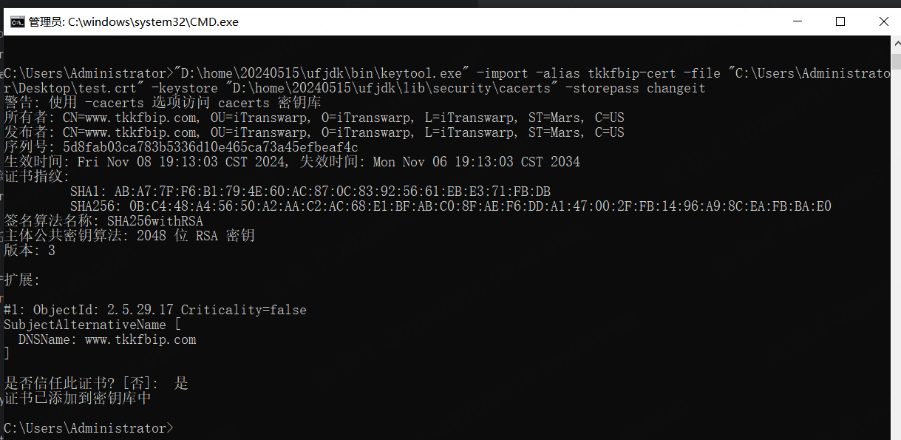